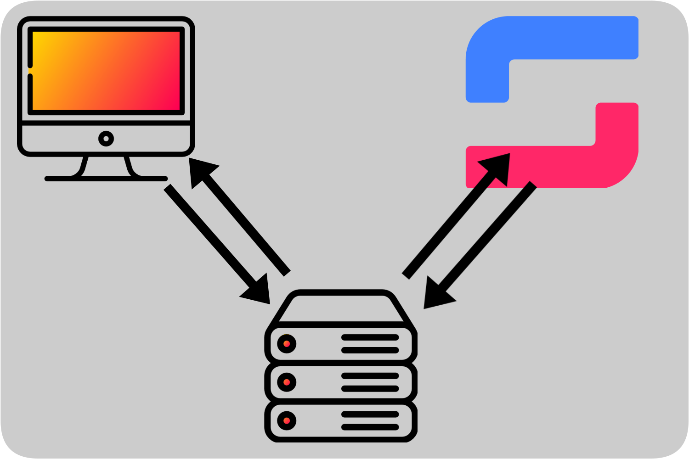

<div id="top"></div>

<!-- PROJECT SHIELDS -->
[![Contributors][contributors-shield]][contributors-url]
[![Issues][issues-shield]][issues-url]
[![MIT License][license-shield]][license-url]

<!-- PROJECT LOGO -->
<br />
<div align="center">
    
  </a>

<h3 align="center">Start.gg API proxy</h3>

  <p align="center">
    A start.gg API proxy to help keep your API keys safe
  </p>
</div>


## About

When working with an API such as start.gg's GraphQL API, managing your API key and making sure not to accidentally reveal it by packaging it with your application or sending it in plain text over the network from your users' computers is of great importance. This project aims to create an API proxy that stores your API key and takes care of communicating with the start.gg API without your API key ever touching your users' computers or networks.

<p align="right">(<a href="#top">back to top</a>)</p>


<!-- GETTING STARTED -->
## Getting Started

To get your own copy of this proxy running, you will need a Cloudflare account to create a Worker on, and a start.gg account to get an API key from

### Prerequisites

#### Node/NPM

Install Node using the instructions on [their website](https://nodejs.org/en/), either a binary install or using your package manager of choice.

#### Wrangler

Wrangler is the command line tool used to manage Cloudflare Workers. Install it using your package manager of choice, or from npm using

```sh
npm install wrangler -g
```

Once installed, connect Wrangler to your Cloudflare account using

```sh
wrangler login
```
## Installation

1. Clone the repo
   ```sh
   git clone https://github.com/jakobkg/startgg-api-proxy.git
   
   cd startgg-api-proxy
   ```
2. Get your Cloudflare account ID by running
   ```sh
   wrangler whoami
   ```
   Then add the account ID to `wrangler.toml`
   ```toml
   account_id = "YOUR ID GOES HERE"
   ```
3. Get your start.gg API key from [your start.gg profile settings](https://www.start.gg/admin/profile/developer), then add this API key to the Worker with 
   ```sh
   wrangler secret put STARTGG_API_KEY
   ```
4. Install dependencies (`typescript` and `webpack` for building, `prettier` for code formatting)
   ```sh
   npm install
   ```
5. All done! You can now run the proxy in a dev environment with
   ```sh
   wrangler dev
   ```
   or publish the proxy to your Cloudflare Workers with
   ```sh
   wrangler publish
   ```
   
<p align="right">(<a href="#top">back to top</a>)</p>


<!-- USAGE EXAMPLES -->
## Usage

This proxy expects to receive a POST request with a body
```json
{
  phaseId: number
}
```
The `phaseId` is used in a query to the start.gg GraphQL API, the exact query can be found in [the query.ts source file](src/query.ts). The response to this query is directly forwarded as a response to the original POST request.

The shape of the response from the start.gg API is consistent and can be consumed into a relatively simple object.

### Typescript example
```ts
declare type PhaseResponse = {
  data: {
    phase?: Phase;
  },
  extensions: {
    cacheControl: {
      version: number;
      hints?: Array<{
        path: Array<string>;
        maxAge: number;
        scope: string;
      }>
    }
    queryComplexity: number;
  },
  actionRecords: Array<{}>; // I have not been able to find documentation on this field,
                            // but have also never seen it populated
}

declare type Phase = {
  name: string;
  sets: {
    nodes: Array<{
      fullRoundText: string;
      round: number;
      slots: Array<{
        entrant: {
          name: string;
        },
        standing: {
          stats: {
            score: {
              value: number;
            }
          }
        }
      }>
    }>
  }
}
```

_For concrete response examples, please refer to the start.gg [API explorer](https://developer.start.gg/explorer) and [schema reference](https://developer.start.gg/reference/query.doc.html)_

<p align="right">(<a href="#top">back to top</a>)</p>


<!-- LICENSE -->
## License

Distributed under the MIT License. See `LICENSE` for more information.

<p align="right">(<a href="#top">back to top</a>)</p>


## Attributions
- <a href="https://www.flaticon.com/free-icons/server" title="server icons">Server icons created by Pixel perfect - Flaticon</a>

- <a href="https://www.flaticon.com/free-icons/computer" title="computer icons">Computer icons created by Freepik - Flaticon</a> 


<!-- MARKDOWN LINKS & IMAGES -->
<!-- https://www.markdownguide.org/basic-syntax/#reference-style-links -->
[contributors-shield]: https://img.shields.io/github/contributors/jakobkg/startgg-api-proxy.svg?style=flat-square
[contributors-url]: https://github.com/jakobkg/startgg-api-proxy/graphs/contributors
[issues-shield]: https://img.shields.io/github/issues/jakobkg/startgg-api-proxy.svg?style=flat-square
[issues-url]: https://github.com/jakobkg/startgg-api-proxy/issues
[license-shield]: https://img.shields.io/github/license/jakobkg/startgg-api-proxy.svg?style=flat-square
[license-url]: https://github.com/jakobkg/startgg-api-proxy/blob/main/LICENSE
[product-screenshot]: images/screenshot.png
